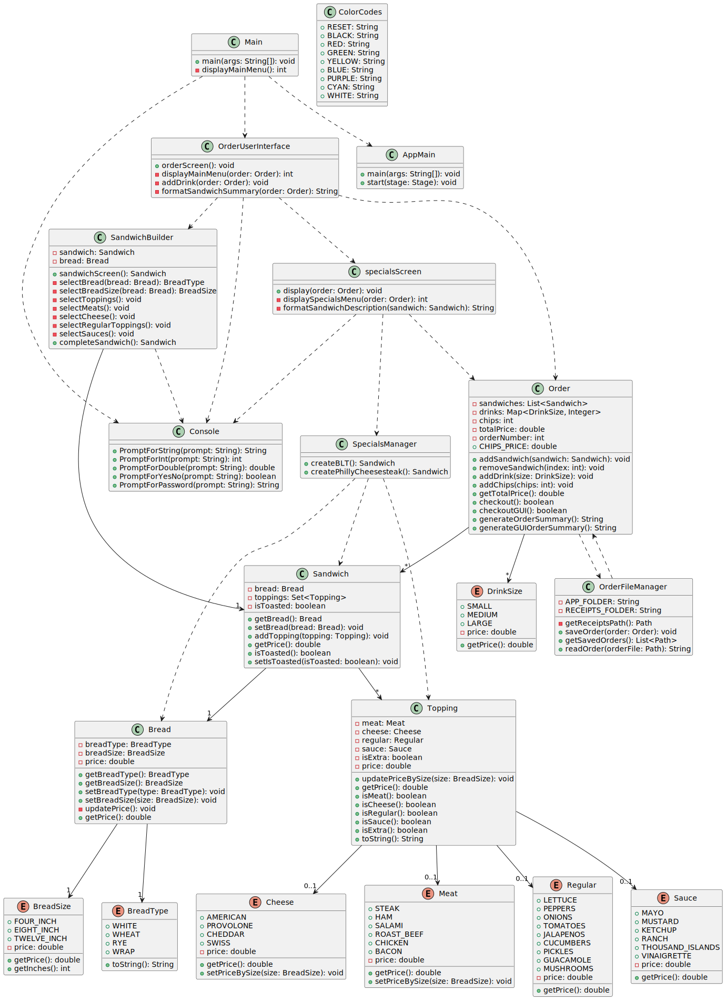
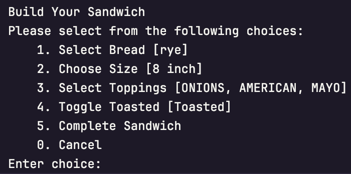
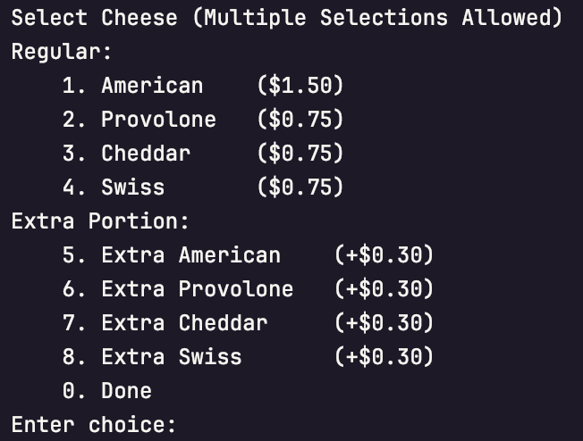
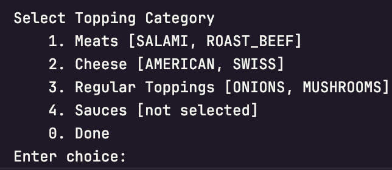
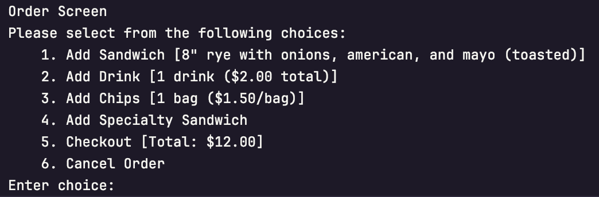

<p align="center">
  
</p>

<h1 align="center">Ali's DELI-cious Sandwich Shop</h1>

<p align="center">
    
    <a href="https://wakatime.com/badge/user/018d6ba0-92b9-4fd1-bdc3-7c0f7b3f179c/project/9176fe18-3ce2-484b-9f1f-4a985df90478">
        
    </a>
    
    
</p>


---

### Project Overview

Ali's DELI-cious Sandwich Shop is a Java application that brings the classic deli experience right to your computer. This app lets you create custom sandwiches, save orders, and save receipts.

Key Features:
- Create **custom sandwiches** just how you like them
- Track your order history with *receipts* in your home directory
- Choose from a variety of fresh, **premium ingredients**
- Choose from a selection of our Specialties: `BLT` and `Philly Cheesesteak`

The application stores receipts locally in the user's home directory under `~/DELIcious-Sandwiches/receipts` for easy access. Whether you're craving a classic `Philly Cheesesteak` or want to create your own masterpiece, Ali's DELI-cious Sandwich Shop makes ordering a *breeze!*


---

<h2 align="center">Class Diagram</h2>
<p align="center">
    
</p>

---

### Screenshots

<details>
<summary>Click to expand! These are the screenshots.</summary>



*Build Your Sandwich Screen - Create your perfect sandwich by selecting `bread`, `size`, and `toppings`. 🥪*




*Cheese Selection Screen - Choose from our premium `cheese` options! 🧀*




*Topping Categories Screen - Browse through our organized selection of `meats`, `cheeses`, `veggies`, and `sauces`! 🥬*




*Order Summary Screen - Review your sandwich and add `drinks` or `chips` to complete your meal! 🥤*

</details>

---

### One Interesting Piece of Code

```Java
public enum Meat {
    STEAK(2.00),
    HAM(1.00),
    SALAMI(1.00),
    ROAST_BEEF(1.00),
    CHICKEN(1.00),
    BACON(1.00);

    private double price;

    Meat(double price) {
        this.price = price;
    }

    public double getPrice() {
        return price;
    }

    public void setPriceBySize(BreadSize size) {
        switch (size) {
            case FOUR_INCH -> this.price = 1.00;
            case EIGHT_INCH -> this.price = 2.00;
            case TWELVE_INCH -> this.price = 3.00;
        }
    }
}
```

The `Meat` enum serves two key purposes:

1. It maintains a catalog of available meat options (`STEAK`, `HAM`, `SALAMI`, etc.)
2. It handles dynamic pricing based on sandwich size

The `setPriceBySize()` method automatically adjusts the price of `meat` based on the `sandwich length`:
- `4-inch` - Base price (`$1.00`)
- `8-inch` - Double the base price (`$2.00`)
- `12-inch` - Triple the base price (`$3.00`)

This design provides a clean, maintainable way to handle pricing logic while ensuring consistency across the application. The use of enums also gives us type safety and prevents `invalid meat selections`.


